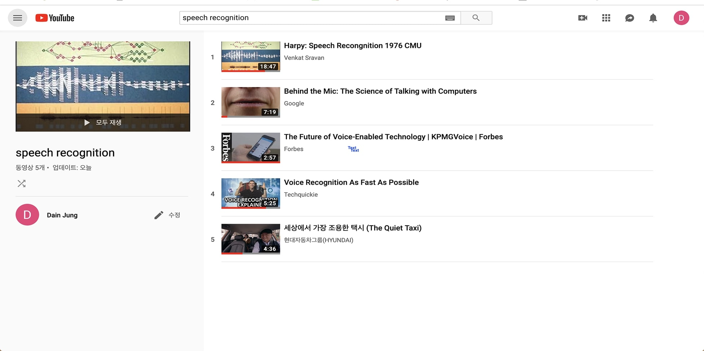

# Speech Recognition Research

[idea101](idea101.md)

- Date: April 6, 2019
- Description: Youtube playlist

I chose to research on Youtube so I can utilize videos. The technology I was researching was speech recognition, so I thought video explanations would be easier to understand since they come with audio and demonstrate the mechanisms behind the technology.

I went through a lot of videos about the technology, and out of those pile of videos selected the ones that were helpful and created a playlist so I can easily go back.
