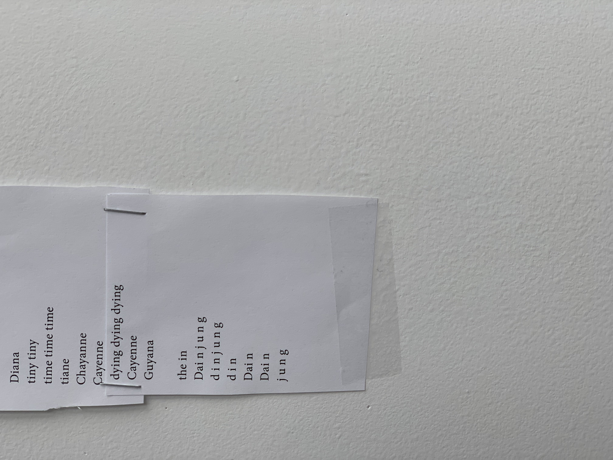

## IDEA No 101

# SPEECH RECOGNITION
---
Speech recognition is very commonly found in our everyday lives nowadays. If you are an I-phone user, there's your Siri to respond at your (literal) call. Galaxy has Bixby. But the areas in which speech recognition branch out is much more than just these intelligent assistants.

The first speech recognition technology was executed in the Bell Laboratories in 1952. Back then it could only understand numbers, and from a single specific person only. However, the development of the Harpy System by Bruce Lowerre and Raf Raddy in Carnegie Mellon University in the 1970s evolved the software dramatically. Now it was able to recognize about 1,000 words spoken by different people. By the time when the Hidden Markov Model was applied to this technology in the 1980s, it had already become similar to what it is like today.

The mechanisms of speech recognition is rather simple. Audio input is taken by a computer and processed into waves. Then it is chopped into tiny pieces in units of phonemes. Then using algorithms, the phonemes are put together into a likely word. These words are then assembled in a language context using the machine's language understanding. Depending on what it is being used for, the next steps may continue into other technologies.

Major benefits of this technology is its convenience. It can be done hands-free, and it may be faster in inputting data than typing. Moreover, the significance of this technology may seem small but for certain people, like those who have impaired hearing or hands gains more access to technology in general through speech recognition. Recently in the Republic of Korea, Hyundai Motors has developed vehicles with Audio-Visual Conversion technology for hearing impaired taxi drivers. As such, speech recognition tech would further spread out in our digital lives and keep facilitating and democratizing the web more and more.

> Artist Dain Jung collaborates with speech recognition to create audio/visual poetry.
